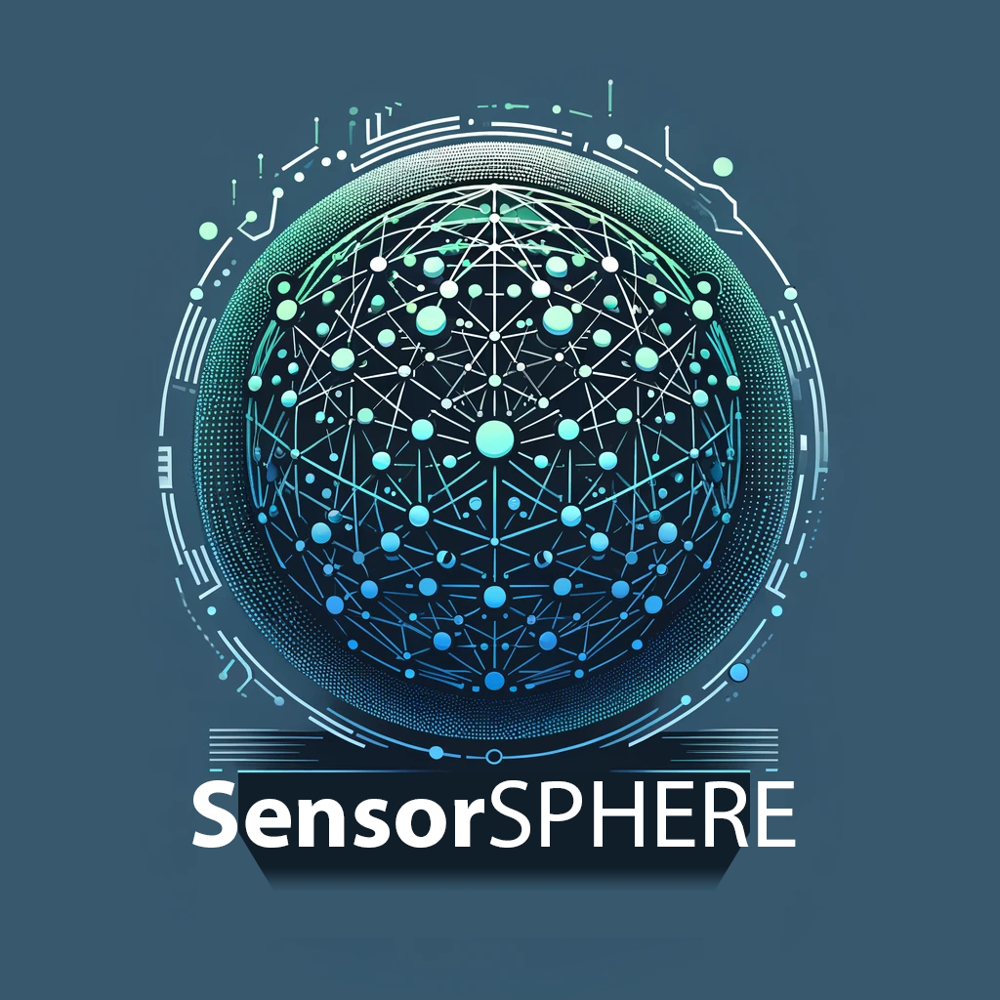

<a id="readme-top"></a>

<!-- Linkedin not yet implemented.
ISsues and Contributors don't work as it can't find the repo -->
<!-- [![Contributors][contributors-shield]][contributors-url]
[![Open Issues][issues-shield]][issues-url]
[![License][license-shield]][license-url] -->
<!-- [![LinkedIn][linkedin-shield]][linkedin-url] -->

<br />
<div align="center">
  <a>
    
  </a>

  <h3 align="center">SensorSPHERE Portal</h3>

  <p align="center">
    A web-based interface for managing SensorSPHERE data collection projects and sessions.
    <br /><br />
    <a href="https://github.com/Maintenance-Lab/SensorSPHEREDocs">View Documentation</a>
    &middot;
    <a href="https://github.com/Maintenance-Lab/SensorSPHEREGateway">Reference SensorSPHERE Gateway</a>
    &middot;
    <a href="https://github.com/Maintenance-Lab/SensorSPHEREUnit">Reference SensorSPHERE Unit</a>

### Frontend
[![React][React.js]][React-url] [![Next.js][Next.js]][Next-url] [![Material-UI][Mui]][Mui-url] [![TypeScript][TypeScript]][TypeScript-url]

### Backend
[![Node.js][Node.js]][Node-url] [![Express][Express]][Express-url] [![Sequelize][Sequelize]][Sequelize-url] [![SQLite][SQLite]][SQLite-url] [![MQTT][MQTT]][MQTT-url] [![TypeScript][TypeScript]][TypeScript-url]
</div>

<details>
  <summary>Table of Contents</summary>
  <ul>
    <li><a href="#about-the-portal">About the Portal</a></li>
    <li><a href="#getting-started">Getting Started</a></li>
    <ul>
      <li><a href="#installation">Installation</a></li>
      <ul>
        <li><a href="#tech-stack">Tech Stack</a></li>
        <li><a href="#dependencies">Dependencies</a></li>
        <li><a href="#clone-repository">Clone Repository</a></li>
        <li><a href="#configuration-setup">Configuration Setup</a></li>
      </ul>
      <li><a href="#running-the-project">Running the Project</a></li>
    </ul>
    <li><a href="#getting-familiar">Getting Familiar</a></li>
    <ul>
      <li><a href="#components">Components</a></li>
      <li><a href="#database-structure">Database Structure</a></li>
    </ul>
    <li><a href="#future-features">Future Features</a></li>
    <li><a href="#license">License</a></li>
  </ul>
</details>

# About the Portal
The **SensorSPHERE Portal** serves as the central management interface within the SensorSPHERE ecosystem. It enables users to efficiently create and manage projects and sessions for data collection from various sensor-equipped devices, known as SensorSPHERE Units.

Through the portal, users can view an overview of all available devices, configure their settings, and initiate data collection sessions remotely. This streamlined process facilitates easy data gathering for research and analysis, making it accessible even for users without extensive programming experience.

To get a better overview of the complete system and how the SensorSPHERE Portal fits within that **please refer to our dedicated documentation page:** <a href="https://github.com/Maintenance-Lab/SensorSPHEREDocs"><strong>Explore the docs »</strong></a>

_Note: The current structure and features reflect an ongoing development process, and some components may not yet represent the final implementation._

<p align="right">(<a href="#readme-top">back to top</a>)</p>

# Getting Started
Follow these instructions to set up and run the SensorSPHERE Portal on your local machine for development and testing purposes.

## Installation

### Tech Stack
Use the tech stack by ensuring you have the following software installed on your system:
* **Node.js**
  ```sh
  sudo apt install nodejs
  ```
* **npm**
  ```sh
  sudo apt install npm
  ```
[Node and npm documentation](https://docs.npmjs.com/downloading-and-installing-node-js-and-npm)
* **SQLite3**
  ```sh
  sudo apt install sqlite3
  ```

<p align="right">(<a href="#readme-top">back to top</a>)</p>

### Dependencies
<!-- Kijk naar de unit (lijst overzicht) (running the project chapter)
requirement.txt  -->

The portal was tested with Node.js v20.17, npm v10.8.2, and SQLite3 v3.45.3. Other versions may also work.
Refer to the package.json files for a full list of module dependencies.

### Clone Repository
Below are the steps to install and set up the SensorSPHERE Portal locally.

1. Clone the repository
   ```sh
    git clone git@github.com:Maintenance-Lab/SensorSPHEREPortal.git
   ```
2. Install backend dependencies
   ```sh
    cd SensorSPHEREPortal
    npm install
   ```
<!-- npm install 2 keer nodig? -->
3. Install frontend dependencies
   ```sh
    cd client
    npm install
   ```

<p align="right">(<a href="#readme-top">back to top</a>)</p>


### Configuration Setup
Before running the application, you may need to set up environment variables for configuration. Create a `.env` file in the root directory with the following content:
```
ENV=development                      # Options: development, production
PORT=9051                            # Port for the backend server
JWT_ACCESS_SECRET=testing            # Secret key for JWT access tokens
JWT_EXPIRESIN=21600                  # JWT token expiration time in seconds
MQTT_URI='mqtt://10.42.0.1:1883'     # MQTT broker URI
SQLITE_PATH='./database/db.sqlite3'  # Path to SQLite database file
DANGEROUSLY_DISABLE_HOST_CHECK=true  # Disable host check for development
FIRMWARE='1.2.2'                     # Firmware version
```
<!-- Describe: only tested on development and locally  -->

<p align="right">(<a href="#readme-top">back to top</a>)</p>


## Running the Project

To start the SensorSPHERE Portal, follow these steps:
1. Ensure the SensorSPHEREGateway is running and connected to the MQTT broker.
For setup or troubleshooting, see the [SensorSPHERE Gateway repository](https://github.com/Maintenance-Lab/SensorSPHEREGateway).
2. Start the backend server
   ```sh
    npm run dev
   ```
3. In a new terminal, start the frontend client
   ```sh
    cd client
    npm run start
   ```

A new browser window should open automatically. If not, navigate to `http://localhost:3000` in your web browser.
You can log in using the default admin credentials:
- Username: `admin`
- Password: `admin`

<p align="right">(<a href="#readme-top">back to top</a>)</p>


# Getting Familiar
Once the SensorSPHERE Portal is running, you can use it to manage and monitor your data collection sessions. The main workflow is outlined below.

## Components
<!-- Screenshots? -->
### Logging In
Access the portal using your credentials.

### Dashboard Overview
The dashboard provides an overview of your most recent projects and a quick button to create a new project.

### Projects
The Projects section is where you manage all your data collection projects. Each project acts as a container for one or more data collection sessions.

You can view existing projects, create new ones, and manage them as needed. Opening a project takes you to its project page, where you can update the project and manage its sessions.

### Sessions
The Sessions section within a project allows you to organize your data collection activities.

You can view existing sessions, create new ones, and manage them as needed. Opening a session takes you to its session page, where you can configure devices and start data acquisition.


### Configure Units
Before starting data acquisition, each **SensorSPHERE Unit** within a session needs to be configured. This step ensures that the devices are properly set up and ready to collect data.

Key actions you can perform during configuration:

- **Select Sensor Properties:** Choose which properties (e.g., temperature, humidity, motion) each device should record during the session.
- **Test Configuration:** Run a configuration test to see the resulting sample rate based on the selected properties. This ensures that the setup is feasible and matches your data collection requirements.
- **Adjust Settings:** If the sample rate or configuration is not suitable, modify the selected properties and test again.
- **Accept Configuration:** Confirm the configuration once you are satisfied with the selected properties and the resulting sample rate. This finalizes the setup and prepares the units to begin data acquisition.

### Data Acquisition
After units are configured, start the session to initiate data acquisition. Monitor device activity and session progress in real-time via the session page. You can stop sessions as needed, and all collected data is automatically stored in an external database for later analysis.

<p align="right">(<a href="#readme-top">back to top</a>)</p>


## Database Structure
The SensorSPHERE Portal uses SQLite to store all project, session, and device data. The diagram below provides a complete overview of the database schema, showing all tables and how they relate to each other.


<p align="right">(<a href="#readme-top">back to top</a>)</p>


# Future Features

See the [open issues](https://github.com/Maintenance-Lab/SensorSPHEREPortal/issues) for a full list of proposed features (and known issues).

<p align="right">(<a href="#readme-top">back to top</a>)</p>


# License
This project is licensed under the MIT License - see the [LICENSE](LICENSE) file for details.

<p align="right">(<a href="#readme-top">back to top</a>)</p>


[React.js]: https://img.shields.io/badge/React-20232A?style=for-the-badge&logo=react&logoColor=61DAFB
[React-url]: https://reactjs.org/
[Next.js]: https://img.shields.io/badge/Next.js-000000?style=for-the-badge&logo=nextdotjs&logoColor=white
[Next-url]: https://nextjs.org/
[Mui]: https://img.shields.io/badge/Material--UI-007FFF?style=for-the-badge&logo=mui&logoColor=white
[Mui-url]: https://mui.com/
[TypeScript]: https://img.shields.io/badge/TypeScript-3178C6?style=for-the-badge&logo=typescript&logoColor=white
[TypeScript-url]: https://www.typescriptlang.org/
[Node.js]: https://img.shields.io/badge/Node.js-339933?style=for-the-badge&logo=node.js&logoColor=white
[Node-url]: https://nodejs.org/
[Express]: https://img.shields.io/badge/Express-000000?style=for-the-badge&logo=express&logoColor=white
[Express-url]: https://expressjs.com/
[Sequelize]: https://img.shields.io/badge/Sequelize-52B0E7?style=for-the-badge&logo=sequelize&logoColor=white
[Sequelize-url]: https://sequelize.org/
[SQLite]: https://img.shields.io/badge/SQLite-07405E?style=for-the-badge&logo=sqlite&logoColor=white
[SQLite-url]: https://www.sqlite.org/
[MQTT]: https://img.shields.io/badge/MQTT-FF6C37?style=for-the-badge&logo=mqtt&logoColor=white
[MQTT-url]: http://mqtt.org/


<!-- MARKDOWN LINKS & IMAGES -->
<!-- https://www.markdownguide.org/basic-syntax/#reference-style-links -->
[contributors-shield]: https://img.shields.io/github/contributors/Maintenance-Lab/SensorSPHEREPortal.svg?style=for-the-badge
[contributors-url]: https://github.com/Maintenance-Lab/SensorSPHEREPortal/graphs/contributors
[forks-shield]: https://img.shields.io/github/forks/othneildrew/Best-README-Template.svg?style=for-the-badge
[forks-url]: https://github.com/othneildrew/Best-README-Template/network/members
[stars-shield]: https://img.shields.io/github/stars/othneildrew/Best-README-Template.svg?style=for-the-badge
[stars-url]: https://github.com/othneildrew/Best-README-Template/stargazers
[issues-shield]: https://img.shields.io/github/issues/Maintenance-Lab/SensorSPHEREPortal/.svg?style=for-the-badge
[issues-url]: https://github.com/Maintenance-Lab/SensorSPHEREPortal/issues
[license-shield]: https://img.shields.io/badge/License-MIT-yellow.svg?style=for-the-badge
[license-url]: https://github.com/Maintenance-Lab/SensorSPHEREPortal/blob/development/LICENSE
[linkedin-shield]: https://img.shields.io/badge/-LinkedIn-black.svg?style=for-the-badge&logo=linkedin&colorB=555
[linkedin-url]: https://linkedin.com/in/othneildrew
[product-screenshot]: images/screenshot.png
[Next.js]: https://img.shields.io/badge/next.js-000000?style=for-the-badge&logo=nextdotjs&logoColor=white
[Next-url]: https://nextjs.org/
[React.js]: https://img.shields.io/badge/React-20232A?style=for-the-badge&logo=react&logoColor=61DAFB
[React-url]: https://reactjs.org/
[Vue.js]: https://img.shields.io/badge/Vue.js-35495E?style=for-the-badge&logo=vuedotjs&logoColor=4FC08D
[Vue-url]: https://vuejs.org/
[Angular.io]: https://img.shields.io/badge/Angular-DD0031?style=for-the-badge&logo=angular&logoColor=white
[Angular-url]: https://angular.io/
[Svelte.dev]: https://img.shields.io/badge/Svelte-4A4A55?style=for-the-badge&logo=svelte&logoColor=FF3E00
[Svelte-url]: https://svelte.dev/
[Laravel.com]: https://img.shields.io/badge/Laravel-FF2D20?style=for-the-badge&logo=laravel&logoColor=white
[Laravel-url]: https://laravel.com
[Bootstrap.com]: https://img.shields.io/badge/Bootstrap-563D7C?style=for-the-badge&logo=bootstrap&logoColor=white
[Bootstrap-url]: https://getbootstrap.com
[JQuery.com]: https://img.shields.io/badge/jQuery-0769AD?style=for-the-badge&logo=jquery&logoColor=white
[JQuery-url]: https://jquery.com


<!-- ## Description
This repository contains the **SensorSPHERE Portal**, part of the broader **SensorSPHERE Project** — a system that automates data gathering, caching, and synchronization across distributed sensor environments.

The SensorSPHERE is composed of three main components:
* **[SensorSPHERE Units](https://github.com/Maintenance-Lab/SensorSPHEREUnit)** - Physical or virtual devices equipped with sensors that collect environmental or experimental data.
* **[SensorSPHERE Gateway](https://github.com/Maintenance-Lab/SensorSPHEREGateway)** - Manages communication between the Units and the backend, handling data buffering and synchronization.
* **SensorSPHERE Portal** - A web-based interface that allows users to create projects and sessions, configure devices, and remotely start data collection. -->